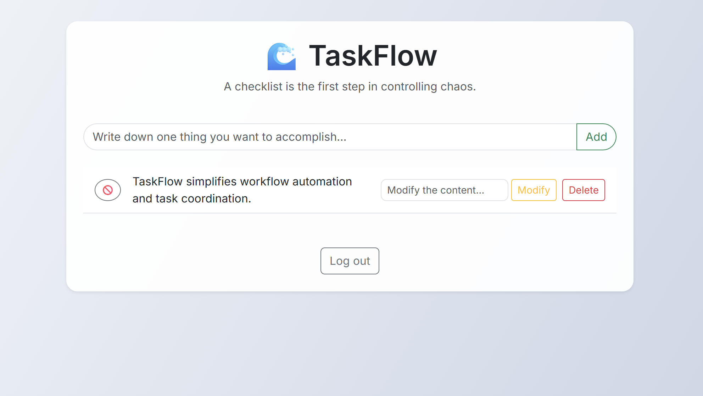
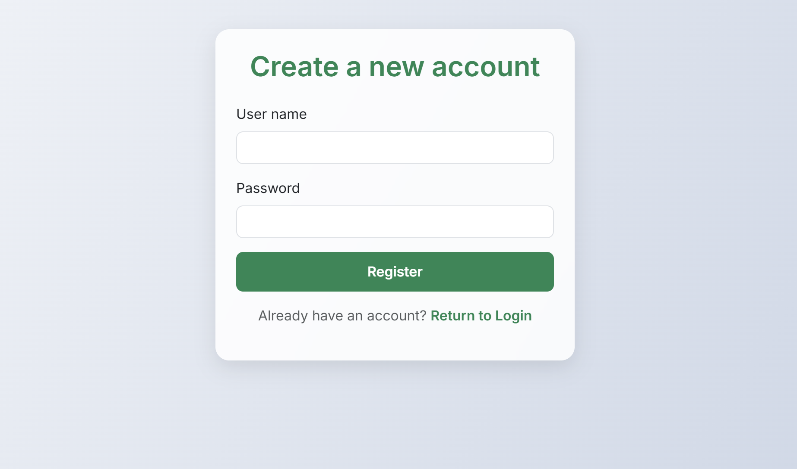

# 🕊 Freedom Tracker — Discipline Builds Freedom

A clean, personal task management web app built for people who want to live with intention — not distraction.

This is not just another to-do list.  
**Freedom Tracker** is a minimal yet powerful system for tracking what truly matters, staying accountable, and taking back control of your time.

---

## ✨ Features

- 👤 **Account system** — Secure registration, login, logout
- 🔐 **Per-user privacy** — Your tasks are completely isolated from others
- 🧾 **Full task flow** — Add, edit, complete, delete tasks with ease
- 💾 **Persistent data** — Stored securely with SQLite
- 📱 **Responsive UI** — Works on desktop and mobile (Bootstrap 5)
- 🔐 **Hashed passwords** — Encrypted with bcrypt for security

---

## 🛠 Tech Stack

- 🐍 Python 3
- 🌐 Flask (backend framework)
- 🗃 SQLite (embedded database)
- 🧠 Jinja2 (HTML templating)
- 🎨 Bootstrap 5 (CSS framework)
- 🔐 bcrypt (password hashing)

---

## 🖼 Screenshots

### ✅ Task Dashboard  


### 🔐 Register Page  


---

## 🚀 Live Demo

🖥️ **Try it here** → [Freedom Tracker on Render](https://freedom-tracker.onrender.com)

> ⚠️ Hosted on Render free tier — it may take up to 30 seconds to cold start.

---

## 🧩 Use Cases

- ✅ Replace your paper or sticky-note task list
- ✅ Stay focused with a clean interface and no distractions
- ✅ Use it to build daily discipline and small habits
- ✅ Make it your first step toward building your own productivity stack

---

## 🧪 Run Locally

```bash
# 1. Clone the repo
git clone https://github.com/your-username/freedom-tracker.git
cd freedom-tracker

# 2. (Optional) Create virtual env
python -m venv venv
source venv/bin/activate  # or .\venv\Scripts\activate on Windows

# 3. Install dependencies
pip install -r requirements.txt

# 4. Init the database
python init_db.py

# 5. Run the app
python app.py
